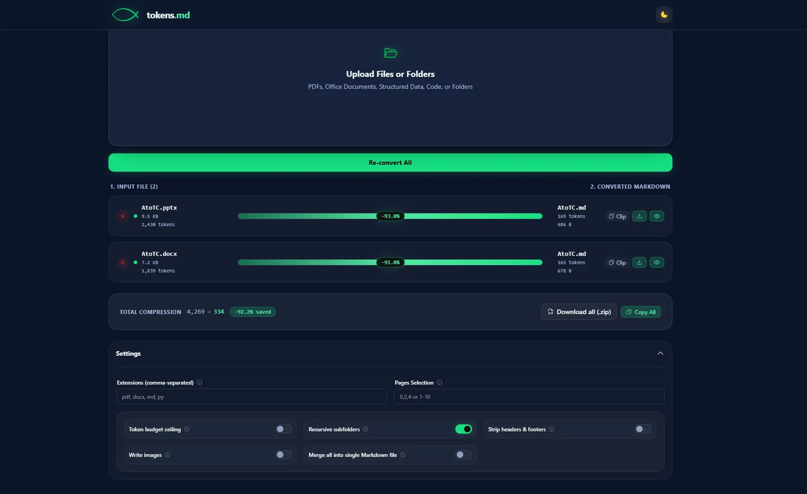

# tokens.md


Tokens.md is my tool for saving tokens when speaking to chatbots by converting files en-masse to Markdown. It turns PDFs, Office documents, e-books, structured data, HTML, web pages, and whole code repositories into clean, token-efficient Markdown you can paste straight into an LLM.

OpenAI's `tiktoken` is used to estimate how many tokens are saved (pretty accurately). In some preliminary results, this conversion is usually anywhere between 60% and 95% of tokens saved (smaller files benefit "more" since a larger proportion of their data is overhead).

## Outline

- [Features](#features)
- [Install](#install)
- [Running](#running)
  - [1. CLI Usage (`tmd`)](#1-cli-usage-tmd)
  - [2. Simple Script Execution (`python src/main.py`)](#2-simple-script-execution-python-srcmainpy)
  - [3. Web Front End (`tmd ui` & Next.js)](#3-web-front-end-tmd-ui--nextjs)
- [Supported Formats](#supported-formats)
- [Development](#development)
- [Documentation](#documentation)
- [License](#license)

## Features

The features of this tool are all encompassed by the `tmd` CLI commands. The front end displays this with an accessible GUI. 

- **`tmd convert`**: convert files to Markdown.
- **`tmd clip`**: convert files to markdown and copy the result to your clipboard.
- **`tmd watch`**: watch a hot folder and auto-convert new files as they appear.
- **`tmd fetch`**: pull a web page and save clean article Markdown.
- **`tmd repo`**: collapse an entire code repository into a single Markdown manifest.
- **`tmd merge`**: combine many files into one master document with a Table of Contents.
- **`tmd delta`**: show how many tokens were saved.
- **`--budget`**: an extra argument to force output size in tokens.

See [the usage guide](#running) for examples

## Install

### Pre-Game

First, make sure you have Python 3.13+, uv, and TypeScript support on your machine. Clone this repository:

```
git clone https://github.com/intelligent-username/tokens.md
```

And create the environment:

```bash
uv venv --python=3.13 .venv

# On Linux or Mac
source .venv/bin/activate

# On Windows
.venv\Scripts\activate

uv pip install -e .               # editable install (provides `tmd`)
```

To update dependencies, just run `uv sync`.

Or install the runtime dependencies directly:

```bash
uv pip install -r requirements.txt
```

## Running



You can run `tokens.md` in three distinct ways depending on your workflow preference. Here they are, ordered from easiest to hardest to use.

### 1. Simple Script Execution (`python src/main.py`)

If you want to run the program directly without installing it as a package, run `src/main.py` using your Python interpreter:

```bash
python src/main.py
```

You can pass standard CLI arguments directly to the script:

```bash
python src/main.py convert input/ -o output/
```

Both bare `tmd` and `python src/main.py` automatically resolve default `input/` and `output/` folders relative to the project root.


### 2. Web Front End (`tmd ui` & Next.js)

The single-page web interface wraps all `tmd` capabilities into an intuitive side-by-side visual workbench featuring drag-and-drop file upload, URL fetching, clipboard copying, and token budgeting.

**Method A: Single CLI Command (`tmd ui`)**
```bash
uv pip install -e ".[web]"
tmd ui
```
This launches the backend server on `http://127.0.0.1:8642` and opens your browser.

> **Note**: `tmd ui` automatically looks for built static assets inside `tmd_ui_static/` (installed package source) or `frontend/out/` (local repository source). If found, it serves both the REST API and the frontend directly on `http://127.0.0.1:8642` as a single unified process.

**Method B: Standalone Development Servers**
If you are developing or modifying the React/Next.js interface and want hot-reloading:

1. Start the FastAPI backend server:
   ```bash
   python -m backend
   ```
2. In a separate terminal, start the Next.js development server:
   ```bash
   cd frontend
   npm install
   npm run dev
   ```
3. Open `http://localhost:3000` in your web browser. (The Next.js dev server proxies API calls to `http://127.0.0.1:8642`).

### 3. CLI Usage (`tmd`)

After installing via `pip install -e .`, the `tmd` command is registered in your environment.

Navigate to the folder containing the files you want to convert and run the following commands. You may manipulate sub-folders and file names, or omit them to use the defaults.

```bash
# Convert all supported files in current repository and write to out/ folder
tmd convert . --loc="out"

# Convert current folder into current directory
tmd convert . --loc

# Bare `tmd` command uses default input/ and output/ directories
tmd

# Other CLI subcommands
tmd merge input/ -o output/merged.md
tmd fetch https://example.com/article -o output/article.md
tmd repo . -o output/repo.md
```

## Development

Install dev dependencies and run the checks:

```bash
uv pip install -e ".[dev]"
pytest
ruff check .
mypy src
```

### Testing PyPI Releases in Isolated Docker Sandbox

To test installed PyPI releases in an ephemeral state, take the following steps:

```bash
# Launch disposable Python container
docker run --rm -it python:3.12-slim bash

# Inside the container shell:
pip install pipx
pipx install tokens-md
pipx ensurepath
export PATH="$HOME/.local/bin:$PATH"

# Test the tmd executable
tmd --version
tmd --help

# More commands...
exit
```

Exiting the shell (`exit`) automatically destroys the container and leaves zero footprint on your system.
These steps can be done in a permanent environment as well (a real docker container or native install), but pipx won't be performing a native install.


## Documentation

- [`docs/USAGE.md`](docs/USAGE.md): full usage guide for every `tmd` subcommand.
- [`docs/ARCHITECTURE.md`](docs/ARCHITECTURE.md): how the converter registry works and how to add new formats.

## License

This project is licensed under the GNU AFFERO GENERAL PUBLIC LICENSE. See more [here](LICENSE)
