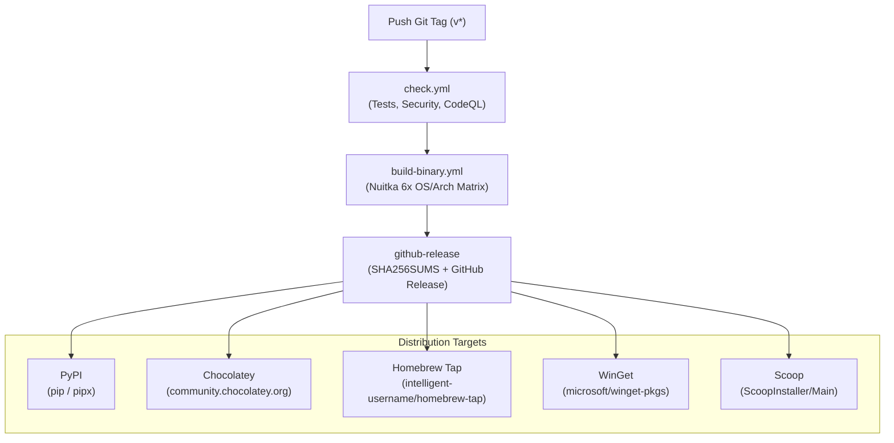

# CLI Distribution & Publishing Guide

Comprehensive operational manual for distributing and maintaining the `tmd` CLI across all supported package managers and binary repositories.

---

## Table of Contents

1. [Architecture & Topology](#1-architecture--topology)
2. [Credentials & Secrets Inventory](#2-credentials--secrets-inventory)
3. [Release Automation Pipeline](#3-release-automation-pipeline)
4. [Platform 1: PyPI (`pip` / `pipx`)](#4-platform-1-pypi-pip--pipx)
5. [Platform 2: Chocolatey (Windows)](#5-platform-2-chocolatey-windows)
6. [Platform 3: Homebrew Tap (macOS & Linux)](#6-platform-3-homebrew-tap-macos--linux)
7. [Platform 4: WinGet (Windows Package Manager)](#7-platform-4-winget-windows-package-manager)
8. [Platform 5: Scoop (Windows)](#8-platform-5-scoop-windows)
9. [Platform 6: Arch User Repository (AUR)](#9-platform-6-arch-user-repository-aur)
10. [Platform 7: MacPorts (macOS)](#10-platform-7-macports-macos)
11. [End-to-End Release Runbook](#11-end-to-end-release-runbook)
12. [Emergency Recovery & Troubleshooting Guide](#12-emergency-recovery--troubleshooting-guide)

---

## 1. Architecture & Topology

The `tmd` distribution strategy provides OS-native, zero-dependency command line binaries and standard package manager integrations:



### Supported Binary Targets
1. **Linux x64**: `tmd-linux-x64` (ELF 64-bit x86-64)
2. **Linux arm64**: `tmd-linux-arm64` (ELF 64-bit AArch64)
3. **macOS x64**: `tmd-macos-x64` (Mach-O 64-bit x86_64)
4. **macOS arm64**: `tmd-macos-arm64` (Mach-O 64-bit arm64 / Apple Silicon)
5. **Windows x64**: `tmd-windows-x64.exe` (PE32+ executable x86-64)
6. **Windows arm64**: `tmd-windows-arm64.exe` (PE32+ executable ARM64)

---

## 2. Credentials & Secrets Inventory

Configure the following secrets in GitHub (**Settings** > **Secrets and variables** > **Actions**):

| Secret Name | Platform | Description | Scope / Permissions |
| :--- | :--- | :--- | :--- |
| `CHOCOLATEY_API_KEY` | Chocolatey | API key generated on `community.chocolatey.org` | Package Push / Publish |
| `HOMEBREW_TAP_TOKEN` | Homebrew | Personal Access Token (Classic or Fine-Grained) | `public_repo` (to push to `intelligent-username/homebrew-tap`) |
| `WINGET_TOKEN` | WinGet, Scoop & MacPorts | Personal Access Token (Classic) | `public_repo` (to submit PRs to `microsoft/winget-pkgs`, `ScoopInstaller/Main` & `macports/macports-ports`) |
| `MACPORTS_TOKEN` | MacPorts | Personal Access Token (Classic) | `public_repo` (optional override for `macports/macports-ports` PRs) |
| `AUR_SSH_PRIVATE_KEY` | AUR (Arch Linux) | SSH Private Key matching public key registered on `aur.archlinux.org` | Push access to `ssh://aur@aur.archlinux.org/tmd-bin.git` |
| *(OIDC / Environment)* | PyPI | Configured via PyPI Trusted Publisher (or `PYPI_API_TOKEN`) | `pypi` GitHub Environment with claim to repository |

---

## 3. Release Automation Pipeline

The primary release workflow is defined in `.github/workflows/release.yml`. When a tag `vX.Y.Z` is pushed:

1. **Check & Test Gate** (`check.yml`): Runs `scripts/verify.py` and `scripts/test.py` (pytest + vitest). Release halts immediately on any test failure.
2. **Binary Compilation Matrix** (`build-binary.yml`): Compiles standalone single-file executables with Nuitka across all 6 OS/arch combinations in parallel.
3. **GitHub Release & Hash Calculation**: Computes `SHA256SUMS.txt`, executes `scripts/update_manifest_hashes.py` to stamp new version strings and SHA-256 hashes into all platform manifests, and creates the GitHub Release.
4. **Platform Publishing**:
   - `publish-pypi` (`.github/actions/publish-pypi`)
   - `publish-chocolatey` (`.github/actions/publish-chocolatey`)
   - `publish-homebrew` (`.github/actions/publish-homebrew`)
   - `publish-winget` (`.github/actions/publish-winget`)
   - `publish-scoop` (`.github/actions/publish-scoop`)

---

## 4. Platform 1: PyPI (`pip` / `pipx`)

### Overview
- **Package Name**: `tmd`
- **Installation Command**:
  ```bash
  pipx install tmd
  # or
  pip install --upgrade tmd
  ```
- **Distribution Files**: Wheel (`.whl`) and Source Archive (`.tar.gz`).

### Initial Setup & Account Configuration
1. Register an account at [pypi.org](https://pypi.org).
2. Configure **Trusted Publishing (OIDC)**:
   - Navigate to PyPI Account Settings > **Publishing**.
   - Add a new publisher for GitHub:
     - Owner: `intelligent-username`
     - Repository: `tokens.md`
     - Workflow name: `release.yml` and `republish-pypi.yml`
     - Environment: `pypi`
3. Alternatively, generate an API token (`pypi-...`) and set it as `PYPI_API_TOKEN` secret.

### Automation Details
- Handled by `.github/actions/publish-pypi/action.yml`.
- Builds distribution packages using `python -m build`.
- Restricts Twine uploads explicitly to `dist/*.tar.gz dist/*.whl` to prevent uploading auxiliary files (like checksum files).

### Manual Re-Publishing (Recovery Workflow)
If the automated PyPI publish step fails during release:
1. Go to **Actions** > **Manual Re-Publish to PyPI (Fallback / Recovery)**.
2. Enter the target tag (e.g. `v0.0.18`) or leave blank for the latest release.
3. Click **Run workflow**.

### Local Manual Publishing (CLI Fallback)
```bash
# Clean previous builds
rm -rf dist/ build/ *.egg-info

# Build wheels and sdist
python -m pip install --upgrade build twine
python -m build

# Check distribution integrity
twine check dist/*

# Upload to PyPI
twine upload dist/*.tar.gz dist/*.whl
```

### Verification
```bash
pipx run --spec tmd==<version> tmd --version
```

---

## 5. Platform 2: Chocolatey (Windows)

### Overview
- **Package Name**: `tmd`
- **Installation Command**:
  ```powershell
  choco install tmd -y
  ```
- **Manifest Location**: `manifests/chocolatey/`

### File Structure
```
manifests/chocolatey/
├── tmd.nuspec                           # NuGet metadata specification
└── tools/
    ├── chocolateyinstall.ps1           # Download and install script with SHA256 validation
    ├── chocolateyuninstall.ps1         # Cleanup script
    ├── LICENSE.txt                     # Embedded license copy
    └── VERIFICATION.txt                # Binary verification and virus scanning notes
```

### Initial Setup & Account Configuration
1. Register at [community.chocolatey.org](https://community.chocolatey.org).
2. Go to **Account** > **API Key** and copy the key.
3. Add the key to GitHub Secrets as `CHOCOLATEY_API_KEY`.

### Automation Details
- Manifest version and binary SHA-256 are automatically updated by `scripts/update_manifest_hashes.py`.
- Handled by `.github/actions/publish-chocolatey/action.yml`:
  ```powershell
  choco pack manifests/chocolatey/tmd.nuspec --outputdirectory dist/
  choco push dist/*.nupkg --source https://push.chocolatey.org/ --api-key "$env:CHOCOLATEY_API_KEY"
  ```

### Manual Re-Publishing (Recovery Workflow)
1. Go to **Actions** > **Manual Re-Publish to Chocolatey (Fallback / Recovery)**.
2. Click **Run workflow** on `main`.

### Local Manual Publishing (CLI Fallback)
```powershell
# From repository root
choco pack manifests/chocolatey/tmd.nuspec --outputdirectory dist/
choco push (Get-Item dist/*.nupkg).FullName --source https://push.chocolatey.org/ --api-key <YOUR_CHOCO_API_KEY>
```

### Verification
```powershell
choco install tmd --version <version> -y --force
tmd --version
```

> [!NOTE]
> Chocolatey packages undergo automated verification followed by human moderation. Status is visible at `https://community.chocolatey.org/packages/tmd/<version>`.

---

## 6. Platform 3: Homebrew Tap (macOS & Linux)

### Overview
- **Formula Name**: `tmd`
- **Tap Repository**: [`intelligent-username/homebrew-tap`](https://github.com/intelligent-username/homebrew-tap) (private)
- **Installation Command**:
  ```bash
  brew tap intelligent-username/tap
  brew install intelligent-username/tap/tmd
  ```
- **Manifest Location**: `manifests/homebrew/tmd.rb`

### Initial Setup & Repository Configuration
1. Create a public GitHub repository: `https://github.com/intelligent-username/homebrew-tap`.
2. Generate a GitHub Personal Access Token (Classic):
   - Name: `HOMEBREW_TAP_TOKEN`
   - Scopes: `public_repo`
3. Add the token to GitHub Secrets as `HOMEBREW_TAP_TOKEN`.

### Formula Architecture (`manifests/homebrew/tmd.rb`)
The formula dynamically supports 4 target architectures by pulling pre-compiled native binaries from GitHub Releases:
- macOS ARM64 (Apple Silicon) -> `tmd-macos-arm64`
- macOS x64 (Intel) -> `tmd-macos-x64`
- Linux x64 -> `tmd-linux-x64`
- Linux ARM64 -> `tmd-linux-arm64`

### Automation Details
- Handled by [`.github/actions/publish-homebrew/action.yml`]
- Automatically clones `intelligent-username/homebrew-tap`, creates `Formula/tmd.rb`, commits, and pushes to `main`.

### Manual Re-Publishing (Recovery Workflow)
1. Go to **Actions** > **Manual Re-Publish to Homebrew (Fallback / Recovery)**.
2. Click **Run workflow** on `main`.

### Local Manual Sync (CLI Fallback)
```bash
# Clone the tap repository
git clone https://github.com/intelligent-username/homebrew-tap.git /tmp/homebrew-tap
mkdir -p /tmp/homebrew-tap/Formula

# Copy formula
cp manifests/homebrew/tmd.rb /tmp/homebrew-tap/Formula/tmd.rb

# Commit and push
cd /tmp/homebrew-tap
git add Formula/tmd.rb
git commit -m "feat(tmd): update formula to v<version>"
git push origin main
```

### Verification
```bash
brew update
brew upgrade intelligent-username/tap/tmd || brew install intelligent-username/tap/tmd
tmd --version
```

---

## 7. Platform 4: WinGet (Windows Package Manager)

### Overview
- **Package Identifier**: `intelligent-username.tmd`
- **Installation Command**:
  ```powershell
  winget install intelligent-username.tmd
  ```
- **Manifest Location**: `manifests/winget/`

### Multi-File Manifest Structure
WinGet community repository requires standard multi-file manifests (singleton manifests are deprecated):

```
manifests/winget/
├── intelligent-username.tmd.yaml                  # Version manifest (ManifestType: version)
├── intelligent-username.tmd.installer.yaml        # Installer manifest (x64 & arm64 portable binaries)
└── intelligent-username.tmd.locale.en-US.yaml     # Metadata & default locale (ManifestType: defaultLocale)
```

### Initial Setup & Authentication
1. Generate a GitHub Personal Access Token (Classic):
   - Name: `WINGET_TOKEN`
   - Scopes: `public_repo`
2. Add the token to GitHub Secrets as `WINGET_TOKEN`.
3. **Microsoft CLA (First submission only)**:
   - On the first PR submitted by `wingetcreate`, the `microsoft-github-policy-service` bot will request a CLA signature.
   - Reply to the PR with the exact comment:
     ```text
     @microsoft-github-policy-service agree
     ```

### Automation Details
- Handled by `.github/actions/publish-winget/action.yml`.
- Automatically downloads Microsoft's official `wingetcreate.exe` CLI and submits the entire `manifests/winget/` multi-file manifest folder:
  ```powershell
  .\wingetcreate.exe submit "manifests/winget" --token "$env:WINGET_TOKEN"
  ```
- `wingetcreate` automatically forks `microsoft/winget-pkgs`, copies manifests to `manifests/i/intelligent-username/tmd/<version>/`, and creates a PR.

### Manual Re-Publishing (Recovery Workflow)
1. Go to **Actions** > **Manual Re-Publish to WinGet (Fallback / Recovery)**.
2. Click **Run workflow** on `main`.

### Local Manual Submission (CLI Fallback)
```powershell
# Download wingetcreate
Invoke-WebRequest -Uri "https://github.com/microsoft/winget-create/releases/download/v1.12.13.0/wingetcreate.exe" -OutFile "wingetcreate.exe"

# Submit multi-file manifests
.\wingetcreate.exe submit manifests/winget --token <YOUR_GITHUB_PAT>
```

### Verification
- Track PR status at `https://github.com/microsoft/winget-pkgs/pulls?q=is%3Apr+intelligent-username.tmd`.
- Once merged and synced to WinGet CDN:
  ```powershell
  winget search intelligent-username.tmd
  winget install intelligent-username.tmd
  tmd --version
  ```

---

## 8. Platform 5: Scoop (Windows)

### Overview
- **Manifest Name**: `tmd.json`
- **Target Repository**: `ScoopInstaller/Main` (official default Scoop bucket)
- **Installation Command**:
  ```powershell
  scoop install tmd
  ```
- **Manifest Location**: `manifests/scoop/tmd.json`

### Initial Setup & Authentication
1. Uses your existing GitHub PAT (`WINGET_TOKEN` or `HOMEBREW_TAP_TOKEN`) with `public_repo` scope.
2. The workflow will automatically fork `ScoopInstaller/Main` to your account, create branch `tmd-<version>`, add `bucket/tmd.json`, and open a Pull Request.

### Manifest Architecture (`manifests/scoop/tmd.json`)
The manifest configures native shims for both `64bit` (x64) and `arm64` executables, plus Scoop's automated version checker:
```json
{
  "version": "0.0.18",
  "description": "Convert files to token-efficient Markdown for LLM prompts",
  "homepage": "https://github.com/intelligent-username/tokens.md",
  "license": "AGPL-3.0-only",
  "architecture": {
    "64bit": {
      "url": "https://github.com/intelligent-username/tokens.md/releases/download/v0.0.18/tmd-windows-x64.exe",
      "hash": "...",
      "bin": [["tmd-windows-x64.exe", "tmd"]]
    },
    "arm64": {
      "url": "https://github.com/intelligent-username/tokens.md/releases/download/v0.0.18/tmd-windows-arm64.exe",
      "hash": "...",
      "bin": [["tmd-windows-arm64.exe", "tmd"]]
    }
  },
  "checkver": "github",
  "autoupdate": {
    "architecture": {
      "64bit": {
        "url": "https://github.com/intelligent-username/tokens.md/releases/download/v$version/tmd-windows-x64.exe"
      },
      "arm64": {
        "url": "https://github.com/intelligent-username/tokens.md/releases/download/v$version/tmd-windows-arm64.exe"
      }
    }
  }
}
```

### Automation & Auto-Update Mechanism
- **Automated Initial PR**: Handled by `.github/actions/publish-scoop/action.yml` using `gh` CLI.
- **Continuous Auto-Updates**: Once merged into `ScoopInstaller/Main`, Scoop's central **Excavator bot** automatically polls `https://github.com/intelligent-username/tokens.md` for new GitHub releases, computes SHA-256 hashes, and commits updates to `ScoopInstaller/Main` automatically on every release.

### Manual Re-Publishing (Recovery Workflow)
1. Go to **Actions** > **Manual Re-Publish to Scoop (Fallback / Recovery)**.
2. Click **Run workflow** on `main`.

### Verification
- Check the PR at `https://github.com/ScoopInstaller/Main/pulls?q=is%3Apr+tmd`.
- Once merged:
  ```powershell
  scoop update
  scoop install tmd
  tmd --version
  ```

---

## 9. Platform 6: Arch User Repository (AUR)

### Overview
- **Package Name**: `tmd-bin`
- **Installation Command**:
  ```bash
  yay -S tmd-bin
  # or
  paru -S tmd-bin
  ```
- **Manifest Location**: `manifests/aur/PKGBUILD`

### Initial Setup & SSH Authentication
1. Register an account on [aur.archlinux.org](https://aur.archlinux.org/register).
2. Generate a dedicated SSH key pair for AUR deployment:
   ```powershell
   ssh-keygen -t ed25519 -f "$HOME\.ssh\aur_key"
   ```
3. Copy the **Public Key** and upload it to your [AUR Profile Settings](https://aur.archlinux.org/account):
   ```powershell
   Get-Content "$HOME\.ssh\aur_key.pub"
   ```
4. Copy the entire **Private Key** (including header and footer lines) and add it to GitHub Secrets:
   ```powershell
   Get-Content "$HOME\.ssh\aur_key"
   ```
   - **Secret Name**: `AUR_SSH_PRIVATE_KEY` (or `AUR_KEY`)

### Automation Details
- Manifest version and Linux binary SHA-256 sums (x86_64 and arm64) are automatically updated by `scripts/update_manifest_hashes.py`.
- Handled by `.github/actions/publish-aur/action.yml` using `KSXGitHub/github-actions-deploy-aur@v3`.
- Automatically generates `.SRCINFO` and pushes updates to `ssh://aur@aur.archlinux.org/tmd-bin.git`.

### Manual Re-Publishing (Recovery Workflow)
1. Go to **Actions** > **Manual Re-Publish to AUR (Fallback / Recovery)**.
2. Click **Run workflow** on `main`.

### Verification
```bash
yay -Syu tmd-bin
tmd --version
```

---

## 10. Platform 7: MacPorts (macOS)

### Overview
- **Port Name**: `tmd`
- **Installation Command**:
  ```bash
  sudo port selfupdate
  sudo port install tmd
  ```
- **Manifest Location**: `manifests/macports/Portfile`

### Overview & Is This For macOS?
Yes, **MacPorts** is an open-source package manager designed specifically for macOS (Darwin). The `Portfile` instructs MacPorts on downloading pre-built native binaries (`tmd-macos-arm64` for Apple Silicon, `tmd-macos-x64` for Intel) from GitHub Releases and installing them to `/opt/local/bin/tmd`.

### Initial Setup & Credentials
1. Uses your existing GitHub PAT (`MACPORTS_TOKEN`, `WINGET_TOKEN`, or `HOMEBREW_TAP_TOKEN`) with `public_repo` scope.
2. The workflow automatically forks `macports/macports-ports`, updates `textproc/tmd/Portfile`, and opens/updates a Pull Request.

### Automation Details
- Manifest version and macOS SHA-256 sums are automatically updated by `scripts/update_manifest_hashes.py`.
- Handled by `.github/actions/publish-macports/action.yml`.

### Manual Re-Publishing (Recovery Workflow)
1. Go to **Actions** > **Manual Re-Publish to MacPorts (Fallback / Recovery)**.
2. Click **Run workflow** on `main`.

### Verification
- Track PR status at `https://github.com/macports/macports-ports/pulls?q=is%3Apr+tmd`.
- Once merged:
  ```bash
  sudo port selfupdate
  sudo port install tmd
  tmd --version
  ```

---

## 11. End-to-End Release Runbook

Follow these steps for every new version release:

### Step 1: Bump Version
Update `version` in `pyproject.toml` (e.g. `0.0.19`).

### Step 2: Run Verification Checks
```bash
python scripts/verify.py
python scripts/test.py
```

### Step 3: Commit and Push to Main
```bash
git add pyproject.toml src/__init__.py
git commit -m "chore(release): bump version to v0.0.19"
git push origin main
```

### Step 4: Create and Push Git Tag
```bash
git tag v0.0.19
git push origin v0.0.19
```

### Step 5: Monitor Pipeline Execution
1. Navigate to GitHub Actions > **Release**.
2. Verify all matrix jobs succeed:
   - `check` (Tests)
   - `build` (6 OS/Arch binaries)
   - `release` (GitHub Release + Manifest SHA-256 updating)
   - `publish-pypi`
   - `publish-chocolatey`
   - `publish-homebrew`
   - `publish-winget`
   - `publish-scoop`
   - `publish-aur`
   - `publish-macports`

---

## 12. Emergency Recovery & Troubleshooting Guide

| Symptom / Error | Root Cause | Remediation |
| :--- | :--- | :--- |
| `twine upload` fails with `Unknown distribution format: 'SHA256SUMS.txt'` | Non-wheel/sdist artifacts in `dist/` | Clean `dist/` before build; target `dist/*.tar.gz dist/*.whl` specifically. |
| Chocolatey error `CHCU0002` (Validation failed) | `<packageTypes>` block present in `.nuspec` | Remove `<packageTypes>` block from `tmd.nuspec`. |
| Homebrew `brew trust` or `untrusted tap` warning | Tap not yet trusted on client | Run `brew tap intelligent-username/tap` explicitly. |
| WinGet `Manifest type not supported: singleton` | WinGet community repo deprecated single-file format | Use multi-file manifests (`version`, `installer`, `defaultLocale`). |
| WinGet `Unknown field: Homepage` | Invalid schema property | Use `PackageUrl` instead of `Homepage`. |
| WinGet PR stuck on `Needs-CLA` | Microsoft CLA unsigned | Post `@microsoft-github-policy-service agree` on the PR. |
| Scoop shim error (`tmd.exe not found`) | Manifest top-level `bin` did not map renamed artifact | Use per-architecture `bin: [["tmd-windows-x64.exe", "tmd"]]`. |
| Automated job fails on one platform | Network or API rate limit | Use the corresponding **Manual Re-Publish to <Platform>** workflow without re-running binary compilation. |

